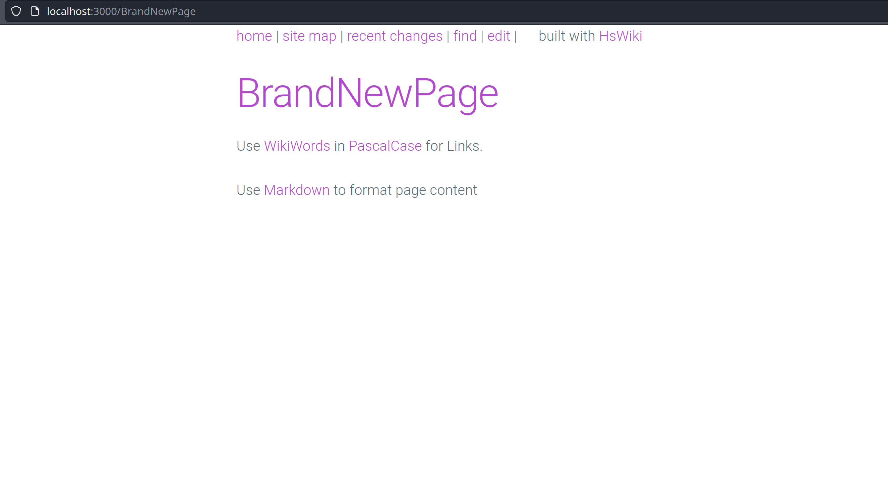

# HsWiki

<a href="https://github.com/thma/HsWiki/actions"></a> 
<a href="https://github.com/thma/HsWiki"></a></p>

## Abstract 
In this blog post I'm presenting an implementation of a Wiki System 
in the spirit of the legendary [C2-Wiki](http://wiki.c2.com/) - written in Haskell with the [Yesod](https://www.yesodweb.com/) framework.

There will also be some nice add-ons like a graphical reprentation of the page links.

## Introduction 

> The WikiWikiWeb is the first wiki, or user-editable website. It was launched on 25 March 1995 by its inventor, programmer Ward Cunningham, to accompany the Portland Pattern Repository website discussing software design patterns. 
> 
>[cited from Wikipedia](https://en.wikipedia.org/wiki/WikiWikiWeb)


The [WikiWikiWeb](http://wiki.c2.com/) was the earliest incarnation of a collaborative hypertext platform on the internet.
It started with a small set of features which proved to provide the essential tools required to create a large content 
base with a dense hyperlink structure. 
Editing and creating new pages was extremely simple which fostered free contributions and a high frequency of 
interactions between participants. 

The most prominent features are:

- A tiny markup language allows basic adjustments of typography and layout.
- All content is rendered as HTML and thus allow easy navigation with any web browser.
- An inplace editor allows adhoc creation and editing of pages. 
  On saving edited content, the page switches back to display mode, which renders the markup as HTML.
- WikiWords, that is Text in PascalCase or [Upper Camel Case](https://en.wikipedia.org/wiki/Camel_case) are interpreted as
  hyperlinks. If such a hyperlink does not link to an existing page, the editor is opened for creating a new page.
  This mechanism allows to create hyperlinked content in a very fast manner.
- Clicking on a Page Title will display a list of all references to the current page.
  This allows to identify related topics and also to organize semantic networks by creating category pages 
  that just keep links to all pages in the category [CategoryCategory](http://wiki.c2.com/?CategoryCategory)
- The RecentChanges page shows the latest creation and edits to pages and thus makes it easy to identify hot topics
- There is a full text search available.

In the following I'm going to explain how I implemented each of those features.

## A simple markup language: Just use Markdown

The original WikiWikiWeb markup language provided basic syntax for layouting text content. 
Modern markup languages like Markdown are a more convenient to use, provide much more features and are already widely used.
So I'm going to use Markdown instead of the original markup language.

## Rendering content as HTML

Yesod comes with a set of [templating mechanisms](https://www.yesodweb.com/book/shakespearean-templates) that ease the generation of HTML, CSS and Javascript for dynamic web content. The HTML templating is backed by the [Blaze Html generator](https://hackage.haskell.org/package/blaze-html). Thus Yesod is optimized to use [Blaze](https://hackage.haskell.org/package/blaze-html) for HTML content. If, for example, the Blaze `Html` data type is returned from route-handlers, Yesod  will automatically set the Content-Type to `text/html`.

So my basic idea is to use a Markdown renderer that can output Blaze `Html`-data and let Yesod do all the heavy lifting.

I'm using the [cmark-gfm](https://hackage.haskell.org/package/cmark-gfm) library to render (GitHub flavoured) Markdown content to HTML. 
In order to output `Html`-data, my `renderMdToHtml` function has to look like follows: 

```haskell
import           CMarkGFM        (commonmarkToHtml)
import           Data.Text       (Text)
import           Text.Blaze.Html (Html, preEscapedToHtml)

renderMdToHtml :: Text -> Html
renderMdToHtml = preEscapedToHtml . commonmarkToHtml [] []
```

## Inplace Content Editing

### Type safe page names

In order to work with the wiki page names in a type safe manner we first introduce a newtype `PageName`.
In order to make sure that only proper [WikiWords](https://en.wikipedia.org/w/index.php?title=WikiWord) can be used as page names I'm using a smart constructor `pageName` which only constructs a `PageName`instance if the intented page name matches the `wikiWordMatch` regular expression:

```haskell
newtype PageName = Page Text deriving (Eq, Read, Show)

pageName :: Text -> Maybe PageName
pageName name =
  if isWikiWord name
    then Just (Page name)
    else Nothing

-- | checks if a given Text is a WikiWord
isWikiWord :: Text -> Bool
isWikiWord pageName =
  case find wikiWordMatch pageName of
    Nothing -> False
    Just _  -> True

-- | the magic WikiWord Regex
wikiWordMatch :: Regex
wikiWordMatch = "([A-Z][a-z0-9]+){2,}"    
```

### The Yesod routes for the editor

The following `PathPiece` instance declaration is required to use the `PageName` as part of a Yesod route definition:

```haskell
instance PathPiece PageName where
  toPathPiece page   = asText page
  fromPathPiece text = pageName text

asText :: PageName -> Text
asText (Page name) = name
```

Again the usage of the `pageName` smart constructor ensures that only proper WikiWord pagenames are constructed.

Here comes the [Yesod route definition](https://www.yesodweb.com/book/basics#basics_routing) for displaying and editing of wiki pages:

```haskell
newtype HsWiki = HsWiki
  { contentDir :: String
  }

mkYesod "HsWiki" [parseRoutes|
/#PageName      PageR     GET             -- (1)
/edit/#PageName EditR     GET POST        -- (2)
|]
```

Definition (1) can be read as follows: for any `PageName` that is accessed via a HTTP GET a route PageR is defined, which (according to the rules of the Yesod routing DSL) requires us to implement a function with the following signature:

```haskell
getPageR :: PageName -> Handler Html
```

This function will have to lookup an existing page, render its Markdown content to Html and return it a `Handler Html` object. We'll have a look at this function shortly.

<!--
```haskell
getPageR :: PageName -> Handler Html
getPageR page = do
  path <- getDocumentRoot
  maybeShowRefs <- lookupGetParam "showBackrefs"
  maybeBackrefs <- liftIO $ computeMaybeBackrefs path (asString page) maybeShowRefs
  let fileName = fileNameFor path (asString page)
  exists <- liftIO $ doesFileExist fileName
  if exists
    then do
      content <- liftIO $ TIO.readFile fileName
      return $ buildViewFor (asText page) (wikiWordToMdLink content) maybeBackrefs
    else do
      redirect $ EditR page
```
--> 

The definition (2) states that for any route /edit/`PageName` two functions must be defined, one for GET one for POST:

```haskell
getEditR  :: PageName -> Handler Html
postEditR :: PageName -> Handler Html
```

### serving an editor

Now let's study the implementation of these two function step by step, first the GET handler:

```haskell
-- | handler for GET /edit/#PageName
getEditR :: PageName -> Handler Html
getEditR pageName = do
  path <- getDocumentRoot                    -- obtain path to document root 
  let fileName = fileNameFor path pageName   -- construct a file from the page name
  exists <- liftIO $ doesFileExist fileName  -- check whether file already exists
  markdown <-
    if exists
      then liftIO $ TIO.readFile fileName    -- if file exists, assign markdown with file content
      else return newPage                    -- else assign markdown with default content
  return $ buildEditorFor pageName markdown  -- return Html for an Editor page

-- | retrieve the name of the HsWiki {contentDir} attribute, defaults to 'content'
getDocumentRoot :: Handler String
getDocumentRoot = getsYesod contentDir  

-- | construct the proper file name for a PageName
fileNameFor :: FilePath -> PageName  -> FilePath
fileNameFor path pageName = path ++ "/" ++ asString pageName ++ ".md"

-- | create default content for a new page
newPage :: Text
newPage =
     "Use WikiWords in PascalCase for Links. \n\n"
  <> "Use [Markdown](https://github.com/adam-p/markdown-here/wiki/Markdown-Cheatsheet) to format page content"
```

As we can see from the reading of markdown content from files, the idea is to just keep all pages as static content files in the filesystem. By default these files reside in the local folder *content* (this folder can be configured by a commandline argument).

Next we'll have a look at the `buildEditorFor` function that will generate the actual Html content of the editor page:


```haskell
buildEditorFor :: PageName -> Text -> Html
buildEditorFor pageName markdown =
  toHtml
    [ pageHeader False,
      menuBar "",
      renderMdToHtml $ "# " <> page <> " \n",
      preEscapedToHtml $
        "<form action=\""
          <> page
          <> "\" method=\"POST\">"
          <> "<textarea style=\"height: auto;\" name=\"content\" cols=\"120\" rows=\"25\">"
          <> markdown
          <> "</textarea>"
          <> "<input type=\"submit\" name=\"save\" value=\"save\" /> &nbsp; "
          <> "<input class=\"button button-outline\" type=\"button\" name=\"cancel\" value=\"cancel\" onClick=\"window.history.back()\" /> "
          <> "</form>",
      pageFooter
    ]
  where page = asText pageName
  ```

The most important element here is the creation of an Html `<form ...>...</form> element.
The action for that form is just the same page but with a `POST`-method (we'll come to the respective handler function `postEditR` shortly).

The resulting Html for editing a new page 'BrandNewPage' will look like this in a browser:


As we can see, I've applied some basic CSS styling [(using Milligram CSS)](https://milligram.io/). This is done in the `pageHeader` function.

### processing the posting of data

The editor has two buttons, *SAVE* and *CANCEL*. On cancel we just navigate back to the previous page in the browser history. On save the browser sends the form data via the `POST` method to the server. To handle this incoming POST-request we'll the `postEditR` handler function:

```haskell
postEditR :: PageName -> Handler Html
postEditR pageName = do
  path <- getDocumentRoot                    -- obtain path to document root
  let fileName = fileNameFor path pageName   -- construct a file from the page name
  maybeContent <- lookupPostParam "content"  -- retrieve POST data
  client <- remoteHost <$> waiRequest        -- retrieve info on remote client from request
  case maybeContent of
    Just content -> liftIO $ do
      TIO.writeFile fileName content         -- if content exists write it to disk
      writeLogEntry path pageName client     -- also write a log entry to file RecentChanges
    Nothing -> return ()                     -- no content: do nothing
  redirect $ PageR pageName                  -- redirect to GET Page route (display content)
  ```

So essentially we are just writing the markdown content into a file. After that we redirect to 
the page renderer:





## Features
* Markup of wiki content is done with (Github flavoured) MarkDown.
* Automatic generation of new pages if non-existing local links are followed by the browser.
  (So to generate a new page just create a new link [new page](new_page) and click the new link.)
* An automatically generated table of contents is available
* For each page it's possible to view a list of all other pages linking back to it.


## How to build
    stack init
    stack install
    HsWiki

## How to deploy as docker container
1. clone the [AlpineHaskell](https://github.com/thma/AlpineHaskell) project:
```
git clone https://github.com/thma/AlpineHaskell.git
```
2. change to the AlpineHaskell directory and build the alpine-haskell docker base-image by executing
```
$ ./build.sh 
Sending build context to Docker daemon  4.808MB
Step 1/2 : FROM alpine:3.7
 ---> 3fd9065eaf02
Step 2/2 : ADD root /
 ---> Using cache
 ---> 20c57b0d04c7
Successfully built 20c57b0d04c7
Successfully tagged alpine-haskell:latest
```
3. verify that the image is visible in the local docker repository
```
$ sudo docker images
REPOSITORY                    TAG                 IMAGE ID            CREATED             SIZE
...
alpine-haskell                latest              20c57b0d04c7        3 weeks ago         8.83MB
...
```
4. Build the hswiki docker image by executing:
```
$ sudo docker build -t hswiki .
Sending build context to Docker daemon  68.05MB
Step 1/5 : FROM alpine-haskell
 ---> 20c57b0d04c7
Step 2/5 : RUN mkdir content
 ---> Using cache
 ---> 052901d31ac2
Step 3/5 : COPY ./.stack-work/install/x86_64-linux-nopie/lts-11.2/8.2.2/bin/HsWiki /hswiki
 ---> Using cache
 ---> 2c0e3e004953
Step 4/5 : EXPOSE 3000
 ---> Using cache
 ---> 0d3309b73c48
Step 5/5 : CMD ["/hswiki"]
 ---> Using cache
 ---> f8e433015d75
Successfully built f8e433015d75
Successfully tagged hswiki:latest
```
5. start up the docker container by
```
$ sudo docker run -it -p 3000:3000 hswiki 
HsWiki starting on port 3000, document root: content
22/Apr/2018:08:41:27 +0000 [Info#yesod-core] Application launched @(yesod-core-1.6.2-BbBvVW2wkIv5HBlOLVMZvZ:Yesod.Core.Dispatch ./Yesod/Core/Dispatch.hs:167:11)
```

With the above command the HsWiki application writes all documents into the /content folder within the
docker container. After restarting the container all these documents will be gone as the
container starts up the original image with an empty /content folder.

In order to keep the generated documents persistent across container restarts you can use the docker --mount option as in the following example. The /tmp folder of the host system is mounted as /content in the docker container. Thus all created documents will be read from or written to the /tmp folder of the host system.

```
sudo docker run -it -p 3000:3000 --mount type=bind,source=/tmp,target=/content hswiki 
HsWiki starting on port 3000, document root: content
22/Apr/2018:08:47:30 +0000 [Info#yesod-core] Application launched @(yesod-core-1.6.2-BbBvVW2wkIv5HBlOLVMZvZ:Yesod.Core.Dispatch ./Yesod/Core/Dispatch.hs:167:11)

```
